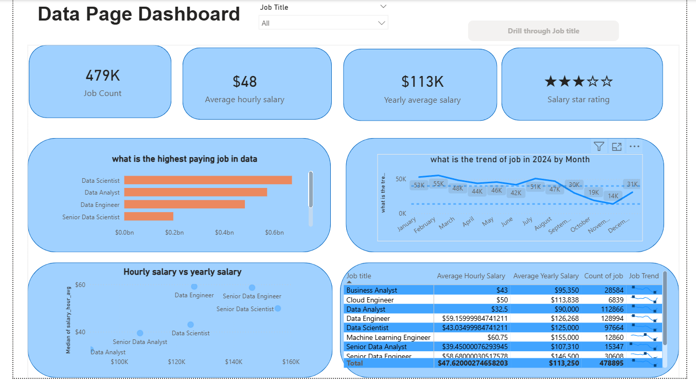
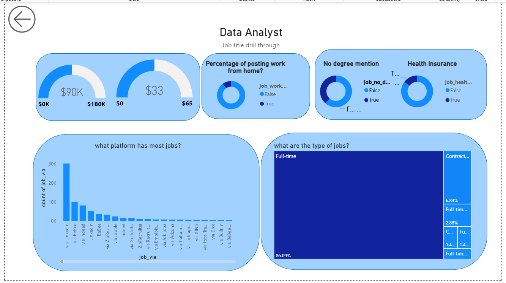

# 📊 My Data Professional Job Market Dashboard

## 📌 Overview

I developed a comprehensive **Power BI dashboard** to analyze the job market for data professionals, including **Data Scientists, Data Analysts, and Data Engineers**.

The project analyzes nearly **479,000 job postings** to uncover insights into:

- Salary trends  
- Job availability  
- Platform preferences  
- Job requirements and perks  

---

## 🛠️ Key Skills Demonstrated

### 📊 Data Visualization & UI Design
- Designed an intuitive and professional dashboard layout  
- Used multiple visual types:
  - Scatter plots  
  - Treemaps  
  - Gauge charts  
  - Donut charts  
  - Bar charts  
  - Line graphs  
- Focused on storytelling through data  

### ⚙️ DAX (Data Analysis Expressions)
- Created dynamic KPIs including:
  - Average hourly salary  
  - Average yearly salary  
  - Total job count  
  - Percentage breakdowns (WFH, Health Insurance, Degree requirement)

### 🔄 Data Cleaning & Transformation
- Used **Power Query** to:
  - Clean raw data  
  - Remove inconsistencies  
  - Standardize fields  
  - Prepare data for modeling  

### 🎯 Advanced Interactive Features
- Drill-through pages  
- Slicers for filtering  
- Cross-filtering between visuals  
- Dynamic exploration of job roles  

### 🧩 Data Modeling
- Structured relationships for accurate filtering  
- Ensured smooth interaction across visuals  

---

## 📈 Dashboard Features & Insights

### 🔹 1. Main Data Overview Page

#### 📌 Key KPIs
- Total Jobs: **479K**
- Average Hourly Salary: **$48**
- Average Yearly Salary: **$113K**

#### 💰 Highest Paying Roles
- Comparison of top-paying positions
- Highlights roles such as:
  - Data Scientist  
  - Data Engineer  

#### 📅 2024 Job Trends
- Monthly job posting trends visualized using a line chart

#### 📉 Salary Scatter Plot
- Correlation between hourly and yearly salaries

#### 📋 Detailed Matrix Table
- Job title breakdown
- Average salaries
- Job counts
- Trend analysis

---

### 🔹 2. Job Title Drill-Through Page

This page provides detailed insights for specific roles (e.g., Data Scientist).

#### 🎯 Role-Specific Metrics
- Example:
  - Data Scientist → **$125K Yearly / $43 Hourly**

#### 🏡 Job Requirements & Perks
- Work From Home (WFH) percentage  
- Health insurance availability  
- Degree requirement breakdown  

#### 🌐 Top Job Platforms
- Shows where jobs are most frequently posted  
- LinkedIn identified as a dominant platform  

#### 💼 Employment Types
- Treemap visualization  
- ~86% Full-Time roles  

---

## 🧰 Tools & Technologies Used

- **Microsoft Power BI**
- **Power Query**
- **DAX (Data Analysis Expressions)**

---

## 🚀 How to Use the Dashboard

1. Download the `.pbix` file from this repository.
2. Open it using **Power BI Desktop**.
3. Use the **Job Title slicer** to filter the dashboard.
4. Right-click on any job title →  
   Select **Drill Through → Job Title Drill Through**  
   to explore detailed insights.

---

## 🎯 Project Objective

This dashboard helps:

- Job seekers understand salary trends  
- Data professionals analyze market demand  
- Recruiters and analysts study hiring patterns  
- Students explore real-world data analytics applications  

---

## ⭐ If You Like This Project

Feel free to:
- Star the repository
- Fork it
- Share it with others